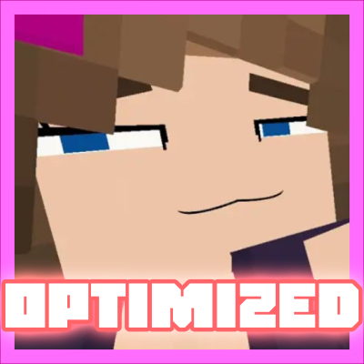

# Jenny-s-Optimized

  

This modpack has been specifically designed to enjoy the Jenny's Mod experience without the lag, stuttering, or low FPS issues that often plague Minecraft 1.12.2 versions. We have implemented the best optimization so that animations and rendering are smooth, even on modest hardware.

## Optimization:

EntityCulling & Nothirium: The heart of performance. Stop rendering what you can't see, gaining a massive amount of FPS in scenes with many entities.

OptiFine: The trusted stabilizer for older versions of Minecraft.

Phosphor & RenderLib: Deep fixes to the lighting and rendering engine to eliminate “lag spikes” when loading new chunks or complex animations.

Ksyxis: Dramatically speeds up load times when entering the world. Less waiting, more action!

## Aesthetics and Details:

3dSkinLayers: Creates 3D reliefs on certain specific textures of your skin (such as hats).

Mellow Shaders: Low-power shaders with incredible aesthetics! (They are disabled by default, only activate them if your PC can handle the shaders).

Cute Mob Models: Because the world needs a more stylized visual touch in line with the theme of the main mod.

Re:Skin: You can use any skin of your choice that has been uploaded to Imgur.

AppleSkin: Essential saturation and food information always in view.

## Guaranteed Stability

Thanks to MixinBooter and MixinBootstrap, all optimization mods work in harmony, ensuring that there are no technical conflicts while you explore Jenny's Mod content.

